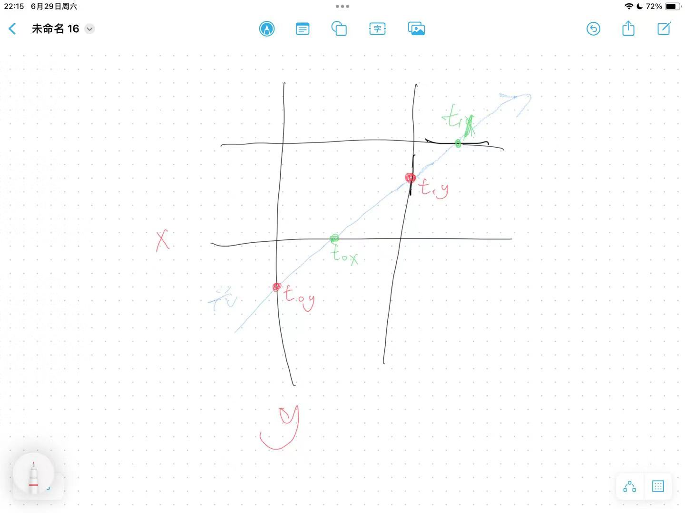

# 真实感渲染大作业

## 实现的功能列表

1. 基础要求WhiteStyle

- 反射（使用反射公式即可）
- 折射（使用折射公式即可，注意出入介质就好）
- 阴影 （直接检验是否在光源照射下即可，此法只能产生硬投影）

2. 基础要求路径追踪

- 轮盘赌无穷递归 （没什么值得注意的，就是一个几何分布）
- 面光源 （让一个物体可以发光，递归到光源返回光色即可，注意距离平方反比）
- Brdf计算以及利用Brdf制作各种材质 （下文讲述）
- NEE加快收敛速度以及减小噪声 （对于漫反射的情况，分为直接光照和间接光照分别计算，并累计色值）

3. 参数曲面求交 （下文讲述）
4. 层次包围盒加速 （下文讲述）
5. 运动模糊 （下文讲述）
6. 景深 （下文讲述）
7. 纹理贴图 （下文讲述）
8. 法向贴图 （下文讲述）
9. 法向插值 （下文讲述）
10. CPU并行加速 （下文讲述）
    下文着重对非基础部分进行叙述和效果展示

## 验收时问题及未验收项

#### NEE直接光照项应该不考虑折射

在验收时，我的NEE的直接光照项的计算逻辑为如果遇到可透射的物体就仍然会继续计算，而不是直接返回，现在已经修改为直接光照只要碰到飞光源的物体就直接返回false。下为**效果图**：


#### 参数曲面求交算法

###### 数学原理

参数曲面求交算法使用牛顿迭代来计算光线与曲面的交点，下为相关计算。
首先我们本质上是要求解光线$R(t) = Origin + t*Direction$与参数曲面$S(u,v)$之间的交点，其中u是参数曲线的自变量,v是旋转变量，所以我们本质上希望$F(t,u,v) = R(t)-S(u,v)$的长度为零，进一步假设我们希望这个向量的每一个分量都为零，故我们计算出F的雅克比矩阵

$$
J = \begin{Bmatrix}
\frac{\partial R_x(t)}{\partial t} & -\frac{\partial S_x(u,v)}{\partial u} & -\frac{\partial S_x(u,v)}{\partial v}\\
\frac{\partial R_y(t)}{\partial t} & -\frac{\partial S_y(u,v)}{\partial u} & -\frac{\partial S_y(u,v)}{\partial v} \\
\frac{\partial R_z(t)}{\partial t} & -\frac{\partial S_z(u,v)}{\partial u} & -\frac{\partial S_z(u,v)}{\partial v}
\end{Bmatrix}
$$

由于曲线的初始值一定只在xy平面,z值为0，所以我们容易得到$S(u,v)  = [ x(u)*cos(2*v*PI) , y(u) , x(u)*sin(2*v*PI) ]$,带入计算可以得到

$$
J = \begin{Bmatrix}
Direction_x & -cos(2PI*v)\frac{\partial x(u)}{\partial u} & 2PI*x(u)*sin(2PI*v)\\
Direction_y & \frac{\partial y(u)}{\partial u} & 0\\
Direction_z & -sin(2PI*v)\frac{\partial x(u)}{\partial u} & -2PI*x(u)*cos(2PI*v)
\end{Bmatrix}
$$

其中x(u)和y(u)的值以及对应的导数在PA2中已经实现，可以直接拿过来使用，但注意上次作业对切向量做了标准化，此处要取消标准化。
这样我们就得到了完整的雅克比矩阵，随后只需要对雅克比矩阵求逆并转置乘F即可得到增量，即

$$
\delta = (J^{-1})^T * F
$$

然后用这个增量去更新我们的u,v,t参数即可。

###### 初值选取

但是由于牛顿法是初值敏感的，初值选择不对会很大程度上影响结果的正确性，我采取的方案是基于包围盒（下文讲述）先求出一个交点，然后把这个交点的u,v,t计算出来作为迭代的初始值，最终才取得较为不错的结果。

**下为效果图**

可以看到花瓶被正常地画出来了

#### 法向贴图算法

法线贴图和纹理贴图的思想基本一致，只不过并不作用与色值而是作用于法向，其本质是存储(uc,vc,nc)色值的一张图，其中uc代表被贴图空间uVector的分量,vc代表vVector的分量,nc则代表这个点本来法向的分量。同时为了使得分量位于区间(-1,1),需要将色值乘2并减一。而具体映射算法见下文纹理映射部分，这部分代码可以完全复用。

一个有趣的点是法向贴图一般还是要保留较多的n的分量，所以最终原始贴图都会呈现出蓝色
**下为效果图**

可以看到墙壁上的凹凸变化

#### CPU并行加速

因为每次采样之间是相互独立的，所以将其划分为多个线程来实现加速，实现较为容易。具体实现只需要在采样的for循环上加如下一行代码，并在CMakeLists里做相关配置即可.

```C++
#pragma omp parallel for num_threads(4)
```

## 已验收的非基础项

#### 层次包围盒加速

此部分分包围盒和分层两部分解释

##### 轴对齐包围盒

对于一个周堆成包围盒存储x,y,z三个维度的最小值和最大值，也即三个区间，具体的构造需要根据不同的物体来定（我实现了球、正方形、三角形、mesh），这个并无难点，主要讲述包围盒求交的算法。

###### 二维的情况

基于如下图来讲解

我们会首先计算出光到x维度的$t_{0x}=\frac{x_min-Origin_x}{Direction_x}$(其余t值计算同理)，然后计算出所有$t_0$的最小值和所有$t_1$的最大值，这本质上就是在划定一个区间，如果最终得到的最小值大于等于最大值则是与包围盒不交

###### 扩展到三维

拓展到三维二维完全相同，只需要在上述的基础上增加$t_{0z},t_{1z}$即可

##### 分层的实现

本质上是一棵kd-tree，每个节点的求交较为容易，因为已经有了写好的包围盒（这个求交算法本质就是包围盒求交）重点是要实现其构造函数。

而kd-tree构造就是实现两个东西，一是本次对于哪个轴进行划分，一个是取该轴的中点来划分左右孩子，我采取的策略是随机选轴，中点划分先使用std中的快速排序对该轴的xmin排序然后取中间的，然后递归地构造左右的kd-tree节点。

分层可以在两个地方使用，一个是对所有物体组成的Group使用，一个是对于一个mesh，对于组成其的所有三角面片使用，从而实现将mesh的求交算法改为基于分层包围盒，大大提高了求交效率。

下为时间上的对比(均不使用CPU并行加速):

在480*480的分辨率情况下采样100次，对于有1000个面片的兔子，使用分层包围盒耗时131s，不使用分层包围盒50min也没跑出来（实在太久了，没有等待其跑完）

#### 运动模糊

引入变量t（时间）来实现运动模糊，对于camery产生的每一个Ray,赋予其一个随机的t变量，对于运动模糊的物体，多存储一个移动向量变量，在求交计算是根据移动向量和时间t计算出新的物体中心$newOrigin = oldOrigin + t*moveVector$然后再进行正常的求交计算即可。

**下为效果图**：


#### 景深

景深的实现较为容易，只需要在camery生成光线时基于焦距和随机角度来sample光线即可，重点是解释其原理，下为原理解释。
我们本质上是希望模拟一件事，就是在焦距处光线可以精准地打到一个像素点上，我的做法是先设置一个可以随机的角度$/theta$，并设置一个焦距$f$,然后对于相机生成的每一条光线以$center$为圆心,$f*tan(\frac{\theta}{2})$sample出来一个点作为出射点$newCenter$，在原center和direction的基础上基于f计算出这次光线会聚焦的位置$p$，然后把新的$(p-newcenter).normalized()$作为新的出射方向。从而实现焦距处清晰，近处和远处模糊的景深效果

**下为效果图**


这是有景深的图


这是没有景深的图

#### 纹理贴图

纹理贴图的核心思路是把纹理空间的坐标映射到三维空间中，对于不同形状的物体有不同的映射方案，下为对球体、正方形、参数曲面映射的原理解释。

###### 正方形

正方形我的构造方法是初始化三个变量$origin,uVector,vVector$,用$origin+u*uVector+v*vVector$来表示这个这个正方形，其中的u,v都是在0-1区间内的，所以直接使用这里的u,v就可以实现纹理空间到三维空间的映射。

###### 参数曲面

参数曲面其实和正方形一样，其定义过程（上文已经写过）就已经有了u,v的定义，同样可以直接使用定义时的u,v来进行纹理映射。

###### 球体

球体的纹理映射是基于球坐标$(\theta,\phi)$来进行的，其中$\theta$是从-y到y的旋转角度,$\phi$是从-x到x的旋转角度，这都可以通过三维空间的交点point来通过三角函数运算得到,具体公式为

$$\theta = acos(-point.y()), \phi = atan2(-point.z(), point.x()) + \pi$$

然后计算u,v为

$$u=\frac{\phi}{2\pi},v=\frac{\theta}{\pi}$$
从而完成纹理映射。
**实现效果**在上面出现的图中都已经看到

#### 法向插值
法向插值的想法是在创建mesh时，给每个顶点一个“法向量”值，其值为包含该顶点的所有三角面片的法向量基于其面积的加权平均，随后在与三角面片求交返回法向量时，根据交点位置的重心坐标来对三个顶点法向量做加权平均得到插值后的法向量。
数学表达如下：
$$n_{vertext} = \frac{\sum_i^N S_i*n_i}{\sum_i^N S_i} $$
$$normal = \lambda *n_{vertext1}+ \phi *n_{vertext2}+ (1-\lambda - \phi)*n_{vertext3} $$
其中$\lambda,\phi$为交点在三角面片内的重心坐标
**下为效果图**：


这是用了法向插值的图


这是没有使用法向插值的图（采样次数较少，但足以说明问题）
#### cooktorrence模型
一种brdf模型，所有以上内容的漫反射都基于cooktorrence模型完成。具体计算公式如下
$$NdotL = dot(normal,incoming),NdotV = dot(normal,outgoing)$$

$$
NdotH = dot(normal,halfVector) , VdotH = dot(outgoing,halfVector)
$$

$$
halfvector=\frac{incoming+outgoing}{2}
$$

$$
F= F0 + (1-F0)*(1-VdotH)^5
$$

$$
D= \frac{NdotV}{NdotV*(1-\frac{(\alpha+1)^2}{8})+\frac{(\alpha+1)^2}{8}}
$$

$$
G= \frac{\alpha^2}{\pi * (NdotH^2 * (\alpha^2-1)+1)^2}
$$

$$
brdfValue=\frac{F*D*G}{max(4*NdotL*NdotV,0.001)}
$$

使用max是为了防止分母为0
而对于这个计算出来的brdf值，本质上是对于该入射光线和法向时出现该出射方向的概率分布。而从路径追踪这一蒙特卡洛的过程中我可以将其理解为该出射光线递归带来的色值对该像素点最终色值的贡献度，从而得到不同的材质。

#### 基于cos-weighted的漫反射采样

在进行漫反射采样时，我基于Lambertian漫反射进行采样，即出射光的概率正比于出射光线和交点法向量之间夹角$\phi$的余弦值，具体实现方法如下：
设交点为$origin$,然后在$origin+normal.normalized()$位置画一个单位球，随后在这个单位球上sample一个点，也即随机出来一个单位向量$unit$，把$(normal.normalized()+unit).normalized$作为最终随机出来的出射光线。如此做就可达到正比于余弦值的效果
这个方法区别于上面对于brdf值的使用，上面是先sample出出射光线然后在计算概率分布，并将其当做贡献度来使用，而这种方法是在采样时就引入了概率分布，从采样的角度来影响材质。

与之类似的，我们可以在镜面反射时引入fuzz项，来让镜面反射这一本来很确定的光线方向出现一定程度的sample，来模拟出glossy的材质，不过我在实现了brdf以后制作出了更好的glossy材质，故将该方法弃用。

## 基础项

### white style
本质就是对于一个像素点只追踪一条光线，对于折射和反射光线的计算就是输入公式即可，故不做赘述。

而对于阴影的处理我们需要从交点处向光源引一条光线，判断这条光线是否能够直接与光源相交，如果被挡住则是阴影区域，这部分代码可以被服用在NEE的直接光照部分。

### 俄罗斯轮盘赌
每次递归有概率P继续进行下去，有(1-p)的概率终止，这样原则上允许无穷递归的出现，但期望上并不会如此。

### 各种基于brdf的材质
在上文中对于cooktorrence模型的讲述和对cos-weighted采样中的讲述中已经解释过。

### 面光源
其实不止是面光源，这个光源材质可以使用在任何几何物体上，在光线追踪过程中如果光线与该发光材质的物体相交，则返回该发光物体的光色即可。（事实上我乘了一项系数$\frac{1}{1+depth}$来模拟光能的衰减，感觉效果还不错）

### NEE(含对比)
NEE的核心思路是把漫反射时，光照分为间接光照和直接光照来达到加快收敛速度和降噪的功能。

对于直接光照的处理，正如上文对于硬投影的描述，我们先在光源上随机sample一个点（这与光源本身的形状有关，对于正方形和球体都很容易实现随机sample）,然后从交点处引出一条光线到光源，判断是否有交点，如果有交（注意不进行任何递归操作），此时我们需要按下式计算色值
$$ color = \frac{emittedColor*brdf(incoming,normal,outgoing)*NdotL*difussionColor}{distance^2} $$

对于间接光照的处理，我们就是基于无穷递归进行颜色的积累，直到达到光源或者达到限定深度或者与所有物体无交停止。

下为不使用NEE时的结果,可以看到有较大的噪点，收敛速度很慢，而使用NEE则可以得到非常精致的图（上文中的图片呈现）。

## 参考

#### 基于PA1的框架实现

#### 参考ray tracing系列书籍（绝世好书，真的很好） https://raytracing.github.io/
